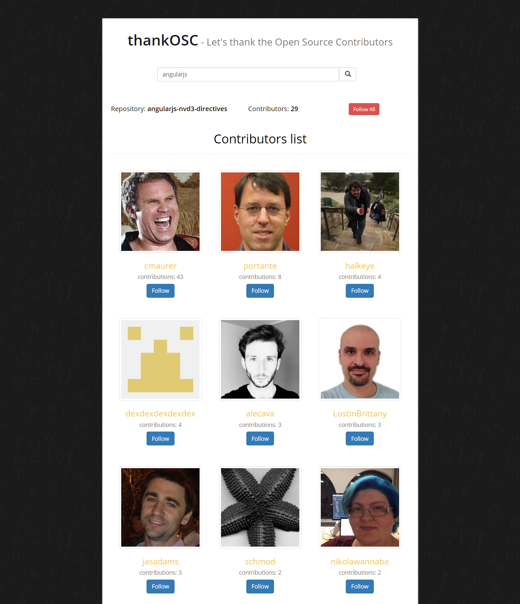

thankOSC - Let's thank the Open Source Contributors
-

Instructions

1. Clone the repository and browse to project folder
2. Run `npm install`
3. Run `node server.js`
4. Browse to http://localhost:8080

